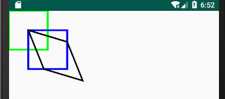

图形绘制及画布操控
---

在开发自定义控件时，在很多情况下我们需要对控件进行一些图形的绘制，以及画布变换操作，下面我们将分别进行介绍。

## 一、基本图形绘制

### 一、 画点

画点的三个方法：
```
public void drawPoint(float x, float y, @NonNull Paint paint)  
public void drawPoints(@Size(multiple = 2) @NonNull float[] pts, @NonNull Paint paint) 
public void drawPoints(@Size(multiple = 2) float[] pts, int offset, int count, @NonNull Paint paint)  
```

画一个点：
```
canvas.drawPoint(200, 200, paint);
```


1. 点的大小取决于画笔的大小（点的边长等于画笔宽度）
* 点是方形的
* 坐标表示点的中心
* 没有空心点
```
paint.setStyle(Paint.Style.FILL);

paint.setStrokeWidth(10);
canvas.drawPoint(100, 200, paint);

paint.setStrokeWidth(30);
canvas.drawPoint(200, 200, paint);

paint.setStrokeWidth(50);
canvas.drawPoint(300, 200, paint);

paint.setStrokeWidth(100);
canvas.drawPoint(400, 200, paint);

paint.setStyle(Paint.Style.STROKE);
canvas.drawPoint(400, 400, paint);
```


绘制一系列的点
```
float[] d = {100f, 100f, 200f, 200f, 300f, 300f};
        
paint.setColor(Color.BLUE);
canvas.drawPoints(d, paint);

paint.setColor(Color.GREEN);
canvas.drawPoints(d, 1, 4, paint);
```


参数offset表示数组偏移数，即从第几个开始
参数count表示绘制的数据量，两个一组

提问小剧场：
1. 如果count传入单数
2. 如果offset + count大于了数组长度

### 二、 线
画线与画点类似，同样三个方法，相似的参数结构
```
drawLines(@Size(multiple = 4) @NonNull float[] pts, int offset, int count,  @NonNull Paint paint)  
drawLines(@Size(multiple = 4) @NonNull float[] pts, @NonNull Paint paint)  
drawLines(@Size(multiple = 4) @NonNull float[] pts, int offset, int count,@NonNull Paint paint) 
```

画一条线
```
paint.setStrokeWidth(10);
canvas.drawLine(100f, 100f, 200f, 100f, paint);

paint.setStrokeWidth(30);
canvas.drawLine(100f, 200f, 200f, 200f, paint);

paint.setStrokeWidth(10);
paint.setStyle(Paint.Style.STROKE);
canvas.drawLine(100f, 300f, 200f, 400f, paint);
```


1. 线的宽度取决于画笔的宽度
* 线的长度取决于起点与终点的距离，与画笔宽度无关
* 坐标表示线端的中心
* 没有空心线

画一系列的线
```
float[] d = {100f, 100f, 100f, 200f, 200f, 200f, 300f, 300f};
canvas.drawLines(d, paint);
```


* 4个点一组，绘制一条直线
* 每条直线不会相接

与画点类似
参数offset表示数组偏移数，即从第几个开始
参数count表示绘制的数据量，四个一组
不足一组的忽略，offset + count 大于数组长度会越界

### 三、 图形、路径、切割

绘制矩形、圆角矩形
```
drawRect(@NonNull Rect r, @NonNull Paint paint)  
drawRoundRect(@NonNull RectF rect, float rx, float ry, @NonNull Paint paint)  
```
例：
```
Rect rect = new Rect(100, 100, 300, 500);
RectF rectF = new RectF(500f, 100, 800, 500);
canvas.drawRect(rect, paint);
paint.setStyle(Paint.Style.STROKE);
paint.setStrokeWidth(30);
canvas.drawRoundRect(rectF, 20, 50, paint);
```


1. 实心空心由画笔决定
* 空心时，轮廓线宽度由画笔决定

圆角矩形圆角半径参数：


所以，可以用绘制圆角矩形的的方式来绘制椭圆/圆，将半径设置成对应边长的一半即可。

提问小剧场：
1. 如果，半径大于对应边长会怎样？
2. 空心图形的轮廓是外延还是内延？


drawRoundRect对大于该数值的参数进行了限制(修正)，凡是大于一半的参数均按照一半来处理。

绘制圆形
```
drawCircle(float cx, float cy, float radius, @NonNull Paint paint)
```
绘制扇形
```
drawArc(@NonNull RectF oval, float startAngle, float sweepAngle, boolean useCenter, @NonNull Paint paint)  
drawArc(float left, float top, float right, float bottom, float startAngle, float sweepAngle, boolean useCenter, @NonNull Paint paint) 
```

例：
```
canvas.drawCircle(200, 200, 100, paint);
RectF rectF = new RectF(500f, 100, 800, 500);
canvas.drawArc(rectF, 0, 60, true, paint);
```


1. 矩形区域内的扇形
* useCenter参数
* 起始角度为正三点方向，旋转方向为顺时针


绘制椭圆
```
public void drawOval(@NonNull RectF oval, @NonNull Paint paint)
public void drawOval(float left, float top, float right, float bottom, @NonNull Paint paint)
```

使用路径进行绘制
```
canvas.drawPath(p, paint);
```

绘制一些图形
```
Rect rect = new Rect(100, 100, 300, 500);

RectF rectF = new RectF(500f, 100, 800, 500);
canvas.drawRect(rect, paint);
paint.setStyle(Paint.Style.STROKE);
paint.setColor(Color.RED);
canvas.drawRoundRect(rectF,20,50,paint);
paint.setStyle(Paint.Style.FILL);
paint.setColor(Color.YELLOW);
canvas.drawCircle(200, 200, 100, paint);

canvas.drawArc(rectF, 0, 360, true, paint);
paint.setColor(Color.GREEN);
canvas.drawArc(rectF, 0, 120, true, paint);
paint.setColor(Color.GRAY);
canvas.drawArc(rectF, 0, 120, false, paint);

paint.setColor(Color.BLACK);
Path p = new Path();
p.moveTo(100, 100);
p.lineTo(200, 200);
p.lineTo(300, 500);
canvas.drawPath(p, paint);
```


提问小剧场：
1. 绘制椭圆有几种方式？

## 二、画布操控

### 一、画布切割

三种裁剪类型：Rect、Path、Region
方法：
```
canvas.clip*(...,Region.Op op)
canvas.clip*(...)  //默认op=INTERSECT
canvas.clipOut*(...)  //默认op=DIFFERENCE 新增，API 26及以上使用
```

例：
```
Rect clipRect = new Rect(100, 100, 200, 200);
canvas.clipRect(clipRect, Region.Op.INTERSECT);
canvas.drawColor(Color.GREEN);
```


五种Op参数类型：

DIFFERENCE：之前剪切过除去当前要剪切的区域（蓝色区域）。

INTERSECT：当前要剪切的区域在之前剪切过内部的部分（紫色区域）。

UNION：当前要剪切的区域加上之前剪切过内部的部分（蓝色区域+紫色区域+橄榄色区域）。

XOR：异或，当前要剪切的区域与之前剪切过的进行异或。（蓝色区域+橄榄色区域）。

REVERSE_DIFFERENCE：与DIFFERENCE相反，以当前要剪切的区域为参照物，当前要剪切的区域除去之前剪切过的区域(橄榄色区域);

REPLACE:用当前要剪切的区域代替之前剪切过的区域。(橄榄色区域+紫色区域);


### 二、 canvas 操作
例：
```
paint.setColor(Color.GREEN);
Rect rect = new Rect(0, 0, 200, 200);
canvas.drawRect(rect, paint);

canvas.translate(100, 100);
paint.setColor(Color.BLUE);
canvas.drawRect(rect, paint);

paint.setColor(Color.BLACK);
canvas.skew(0.4f, 0.3f);
canvas.drawRect(rect, paint);
```


* canvas操作的不是画布，操作的是“尺标”  (个人理解)

几种操作：
* 平移：translate(float dx, float dy)
* 旋转：rotate(float degrees) //角度方向为顺时针
* 缩放：scale(float sx, float sy) 、scale(float sx, float sy, float px, float py)
* 扭曲/倾斜：skew(float sx, float sy)  //参数为倾斜角度的tan值

### 三、画布保存与恢复

前面我们通过一些方法实现了对画布的大小（切割）及状态（平移旋转等），但这些操作是不可逆的（平移回来只算叠加，不算复原）。
为解决这类问题，canvas提供了保存画布和恢复画布的两个方法：
```
canvas.save();
canvas.save(int saveFlags);
canvas.restore();
canvas.restoreToCount(int count);
```
* 每次调用save()函数，都会把当前的画布的状态进行保存，然后放入特定的栈中
* 每当调用restore()函数，就会把栈中最顶层的画布状态取出来，并按照这个状态恢复当前的画布，并在这个画布上做画
* restoreToCount(int count) 表示依次恢复到第几层，count的最小值为1
(注意：调用restore()时，若栈中为空，则会抛出异常:
```
throw new IllegalStateException("Underflow in restore - more restores than saves")
```
)


### 四、新建图层——saveLayer()

layer: 层，层次，图层
新建一个矩形区图层
```
public int saveLayer(RectF bounds, Paint paint, int saveFlags)  
public int saveLayer(float left, float top, float right, float bottom,Paint paint, int saveFlags)
canvas.saveLayerAlpha(...) //新建的图层设置透明度属性
```

saveFlags 参数：  

save()、saveLayer()共用
* ALL_SAVE_FLAG：保存所有的标识

* MATRIX_SAVE_FLAG：仅保存canvas的matrix数组，即保存canvas的状态

* CLIP_SAVE_FLAG：仅保存canvas的当前大小

saveLayer()专用
* HAS_ALPHA_LAYER_SAVE_FLAG：标识新建的bmp具有透明度，在与上层画布结合时，透明位置显示上图图像,
与FULL_COLOR_LAYER_SAVE_FLAG冲突，若同时指定，则以HAS_ALPHA_LAYER_SAVE_FLAG为主

* FULL_COLOR_LAYER_SAVE_FLAG：标识新建的bmp颜色完全独立，在与上层画布结合时，先清空上层画布再覆盖上去(默认使用此方法)

* CLIP_TO_LAYER_SAVE_FLAG：在保存图层前先把当前画布根据bounds裁剪，与CLIP_SAVE_FLAG冲突，若同时指定，则以CLIP_SAVE_FLAG为主

saveLayer()可以分为两个步骤：
1. 保存当前画布状态到栈
2. 新建一个图层
*（新图层的“尺标”与前一个图层/画布一致）

例：
```
canvas.drawColor(Color.RED);  
canvas.saveLayer(0,0,500,500,mPaint,Canvas.FULL_COLOR_LAYER_SAVE_FLAG);  
canvas.drawRect(100,100,300,300,mPaint);  
```


```
canvas.drawColor(Color.RED);  
canvas.saveLayer(0,0,500,500,mPaint,Canvas.HAS_ALPHA_LAYER_SAVE_FLAG);  
canvas.drawRect(100,100,300,300,mPaint);
```


## 结语

在画布的操作上，官方给我们提供了众多的api，以便在各种情况下使用：

* 绘制颜色：drawColor, drawRGB, drawARGB
* 绘制图形：drawPoint, drawPoints, drawLine, drawLines, drawRect,drawRoundRect, drawOval, drawCircle, drawArc
* 绘制图片：drawBitmap, drawPicture
* 绘制文本：drawText, drawPosText, drawTextOnPath
* 绘制路径：drawPath
* 顶点操控：drawVertices, drawBitmapMesh
* 画布剪裁：clipPath, clipRect
* 画布保存：save, restore, saveLayerXxx, restoreToCount, getSaveCount
* 画布变换：translate, scale, rotate, skew
* 图像矩阵：getMatrix, setMatrix, concat

这里我们主要讨论了图形的绘制，和画布的裁剪、保存与变换。后面我们将继续讨论颜色、图片、文本、路径的绘制以及比较复杂的矩阵变换。