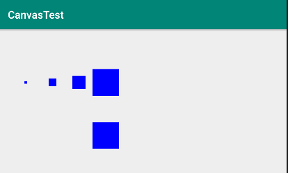
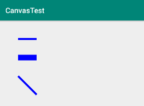
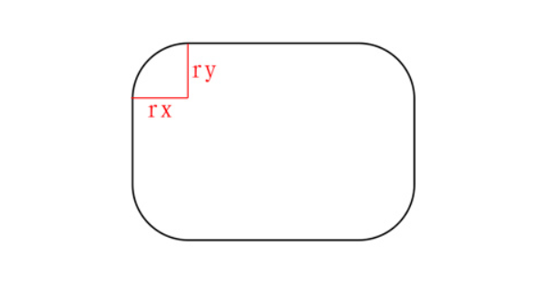

### 一、 画点

画点的三个方法：
```
public void drawPoint(float x, float y, @NonNull Paint paint)  
public void drawPoints(@Size(multiple = 2) @NonNull float[] pts, @NonNull Paint paint) 
public void drawPoints(@Size(multiple = 2) float[] pts, int offset, int count, @NonNull Paint paint)  
```

画一个点：
```
canvas.drawPoint(200, 200, paint);
```


1. 点的大小取决于画笔的大小（点的边长等于画笔宽度）
* 点是方形的
* 坐标表示点的中心
* 没有空心点
```
paint.setStyle(Paint.Style.FILL);

paint.setStrokeWidth(10);
canvas.drawPoint(100, 200, paint);

paint.setStrokeWidth(30);
canvas.drawPoint(200, 200, paint);

paint.setStrokeWidth(50);
canvas.drawPoint(300, 200, paint);

paint.setStrokeWidth(100);
canvas.drawPoint(400, 200, paint);

paint.setStyle(Paint.Style.STROKE);
canvas.drawPoint(400, 400, paint);
```


绘制一系列的点
```
float[] d = {100f, 100f, 200f, 200f, 300f, 300f};
        
paint.setColor(Color.BLUE);
canvas.drawPoints(d, paint);

paint.setColor(Color.GREEN);
canvas.drawPoints(d, 1, 4, paint);
```


### 二、 线
画线与画点类似，同样三个方法，相似的参数结构
```
drawLines(@Size(multiple = 4) @NonNull float[] pts, int offset, int count,  @NonNull Paint paint)  
drawLines(@Size(multiple = 4) @NonNull float[] pts, @NonNull Paint paint)  
drawLines(@Size(multiple = 4) @NonNull float[] pts, int offset, int count,@NonNull Paint paint) 
```

画一条线
```
paint.setStrokeWidth(10);
canvas.drawLine(100f, 100f, 200f, 100f, paint);

paint.setStrokeWidth(30);
canvas.drawLine(100f, 200f, 200f, 200f, paint);

paint.setStrokeWidth(10);
paint.setStyle(Paint.Style.STROKE);
canvas.drawLine(100f, 300f, 200f, 400f, paint);
```


1. 线的宽度取决于画笔的宽度
* 线的长度取决于起点与终点的距离，与画笔宽度无关
* 坐标表示线端的中心
* 没有空心线

画一系列的线
```
float[] d = {100f, 100f, 100f, 200f, 200f, 200f, 300f, 300f};
canvas.drawLines(d, paint);
```


* 4个点一组，绘制一条直线
* 每条直线不会相接

### 三、 图形、路径、切割

绘制矩形、圆角矩形
```
drawRect(@NonNull Rect r, @NonNull Paint paint)  
drawRoundRect(@NonNull RectF rect, float rx, float ry, @NonNull Paint paint)  
```

所以，可以用绘制圆角矩形的的方式来绘制椭圆/圆，将半径设置成对应边长的一半即可。
如果，半径大于对应边长会怎样？


drawRoundRect对大于该数值的参数进行了限制(修正)，凡是大于一半的参数均按照一半来处理。

绘制圆形
```
drawCircle(float cx, float cy, float radius, @NonNull Paint paint)
```
绘制扇形
```
drawArc(@NonNull RectF oval, float startAngle, float sweepAngle, boolean useCenter, @NonNull Paint paint)  
drawArc(float left, float top, float right, float bottom, float startAngle, float sweepAngle, boolean useCenter, @NonNull Paint paint) 
```
1. 矩形区域内的扇形
* useCenter参数
* 起始角度为正三点方向，旋转方向为顺时针


绘制椭圆
```
public void drawOval(@NonNull RectF oval, @NonNull Paint paint)
public void drawOval(float left, float top, float right, float bottom, @NonNull Paint paint)
```

使用路径进行绘制
```
canvas.drawPath(p, paint);
```

绘制一些图形
```
Rect rect = new Rect(100, 100, 300, 500);

RectF rectF = new RectF(500f, 100, 800, 500);
canvas.drawRect(rect, paint);
paint.setStyle(Paint.Style.STROKE);
paint.setColor(Color.RED);
canvas.drawRoundRect(rectF,20,50,paint);
paint.setStyle(Paint.Style.FILL);
paint.setColor(Color.YELLOW);
canvas.drawCircle(200, 200, 100, paint);

canvas.drawArc(rectF, 0, 360, true, paint);
paint.setColor(Color.GREEN);
canvas.drawArc(rectF, 0, 120, true, paint);
paint.setColor(Color.GRAY);
canvas.drawArc(rectF, 0, 120, false, paint);

paint.setColor(Color.BLACK);
Path p = new Path();
p.moveTo(100, 100);
p.lineTo(200, 200);
p.lineTo(300, 500);
canvas.drawPath(p, paint);
```


