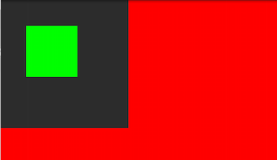

### 画布保存与恢复

前一节中我们通过一些方法实现了对画布的大小（切割）及状态（平移旋转等），但这些操作是不可逆的（平移回来只算叠加，不算复原）。
为解决这类问题，canvas提供了保存画布和恢复画布的两个方法：
```
canvas.save();
canvas.save(int saveFlags);
canvas.restore();
canvas.restoreToCount(int count);
```
* 每次调用save()函数，都会把当前的画布的状态进行保存，然后放入特定的栈中
* 每当调用restore()函数，就会把栈中最顶层的画布状态取出来，并按照这个状态恢复当前的画布，并在这个画布上做画
* restoreToCount(int count) 表示依次恢复到第几层，count的最小值为1
(注意：调用restore()时，若栈中为空，则会抛出异常:
```
throw new IllegalStateException("Underflow in restore - more restores than saves")
```
)


### 新建图层——saveLayer()

layer: 层，层次，图层
新建一个矩形区图层
```
public int saveLayer(RectF bounds, Paint paint, int saveFlags)  
public int saveLayer(float left, float top, float right, float bottom,Paint paint, int saveFlags)
```

参数：saveFlags
save()、saveLayer()共用
* ALL_SAVE_FLAG：保存所有的标识

* MATRIX_SAVE_FLAG：仅保存canvas的matrix数组，即保存canvas的状态

* CLIP_SAVE_FLAG：仅保存canvas的当前大小

saveLayer()专用
* HAS_ALPHA_LAYER_SAVE_FLAG：标识新建的bmp具有透明度，在与上层画布结合时，透明位置显示上图图像,
与FULL_COLOR_LAYER_SAVE_FLAG冲突，若同时指定，则以HAS_ALPHA_LAYER_SAVE_FLAG为主

* FULL_COLOR_LAYER_SAVE_FLAG：标识新建的bmp颜色完全独立，在与上层画布结合时，先清空上层画布再覆盖上去(默认使用此方法)

* CLIP_TO_LAYER_SAVE_FLAG：在保存图层前先把当前画布根据bounds裁剪，与CLIP_SAVE_FLAG冲突，若同时指定，则以CLIP_SAVE_FLAG为主

saveLayer()可以分为两个步骤：
1. 保存当前画布状态到栈
2. 新建一个图层

例：
```
canvas.drawColor(Color.RED);  
canvas.saveLayer(0,0,500,500,mPaint,Canvas.FULL_COLOR_LAYER_SAVE_FLAG);  
canvas.drawRect(100,100,300,300,mPaint);  
```


```
canvas.drawColor(Color.RED);  
canvas.saveLayer(0,0,500,500,mPaint,Canvas.HAS_ALPHA_LAYER_SAVE_FLAG);  
canvas.drawRect(100,100,300,300,mPaint);
```


